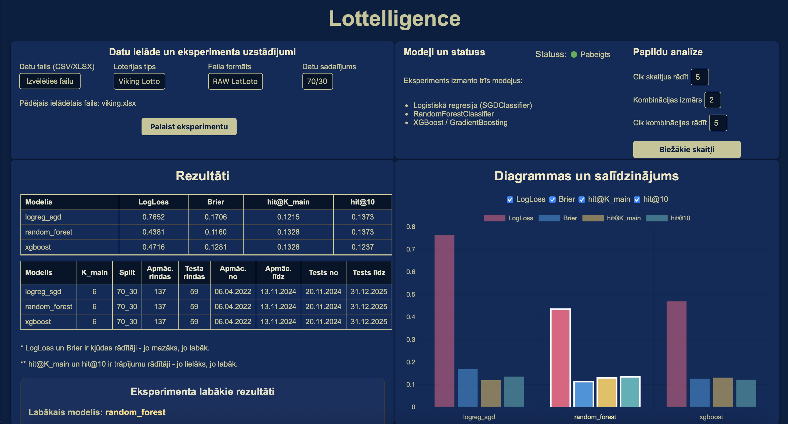

# Lottelligence


## Interfeisa piemērs

<p align="center">
  
</p>

**Lottelligence** ir Flask tīmekļa prototips (Python), kas analizē **Eurojackpot** un **Viking Lotto** vēsturiskos izložu datus, tos normalizē, palaiž vairākus mašīnmācīšanās modeļus un salīdzina to sniegumu pēc varbūtību un “top‑K” metriku rādītājiem

Šis rīks nav paredzēts nākamo izložu prognozēšanai. Tas ir **eksperimentu un pētījuma prototips**, kura mērķis ir pārbaudīt:

- vai ML modeļi spēj atpazīt jebkādas likumsakarības nejaušā procesā  
- kā atšķiras dažādu algoritmu uzvedība  
- kādas metrikas ir piemērotas šāda tipa problēmām  

---

## Atbalstītās loterijas un noteikumi

### Viking Lotto
- **6 pamat skaitļi** (1–48)  
- **1 papildskaitlis** (1–5)

### Eurojackpot
- **5 pamat skaitļi** (1–50)  
- **2 papildskaitļi** (1–12)

Šobrīd modeļi tiek trenēti **tikai uz pamat skaitļiem**
Papildskaitļi tiek nolasīti un normalizēti, bet **modeļos netiek izmantoti**

---

## Izmantotās tehnoloģijas

Prototips ir realizēts Python vidē, izmantojot šādas galvenās bibliotēkas un rīkus:

- **Flask** – tīmekļa interfeiss un API maršruti
- **Pandas** – datu ielāde un apstrāde
- **NumPy** – numeriskie aprēķini
- **Scikit-learn** – mašīnmācīšanās algoritmi
- **XGBoost** (ja pieejams) – gradientu pastiprināšanas modelis
- **HTML + CSS + JavaScript** – lietotāja interfeiss
- **AJAX / Fetch API** – asinhrona datu pieprasīšana bez lapas pārlādes

---

## Datu formāti (augšupielāde)

Lietotājs interfeisā izvēlas:
- **Lottery type**: loteriju (`Viking Lotto` / `Eurojackpot`)
- **File format**: datu formātu (`RAW LatLoto` / `PREPARED`)
- augšupielādē failu (`.xlsx` vai `.csv`) **(piemēram RAW datus no ./uploads)**

### RAW LatLoto formāts
Failā jābūt kolonnām (precīzi nosaukumi):
- `Izlozes Nr.`
- `Datums`
- `Izlozētie skaitļi`

Kolonnā `Izlozētie skaitļi` var būt:
- tikai pamat skaitļi: `4 9 15 21 31 38`
- pamat + papildskaitļi ar “+”: `10 15 18 24 39 + 2 11`

### PREPARED formāts
Failā jābūt sagatavotām kolonnām:
- `draw_no`, `date`, `n1..n5`

Izvēles (ja ir):
- `n6` (Viking Lotto)
- `b1`, `b2` (Eurojackpot)

---

## Normalizācija (vienotais formāts)

Neatkarīgi no ievades (RAW vai PREPARED), dati tiek pārveidoti vienotā shēmā:

- `draw_no`
- `date`
- `n1..n5`
- `n6` (ja loterijā ir 6 pamat skaitļi – Viking Lotto)
- `b1`, `b2` (ja ir papildskaitļi – Eurojackpot)

Pēc normalizācijas dati tiek sakārtoti pēc datuma

### Drošības pārbaudes (nepareiza loterija)
Sistēma pārbauda, vai lietotāja izvēlētais loterijas tips atbilst datu struktūrai:
- ja izvēlēts `Eurojackpot`, bet failā redzams tipisks `Viking Lotto` skaitļu skaits/diapazons -> kļūda
- ja izvēlēts `Viking Lotto`, bet failā redzams tipisks `Eurojackpot` formāts -> kļūda
- ja skaitļi pārsniedz atļauto diapazonu (piem., Viking Lotto > 48) -> kļūda

Tas novērš situāciju, kad modeļi tiek trenēti uz “nepareizu” loteriju
---

## Eksperimenta uzstādījums (X un Y veidošana)

Prototips izmanto vienkāršu un aizstāvamu pieeju: **lagged features** (iepriekšējā izloze -> nākamā izloze)

### 1) Katra izloze tiek pārvērsta **one-hot vektorā** tikai pamat skaitļiem:
- Viking Lotto: garums 48  
- Eurojackpot: garums 50  

Vektora pozīcija `i` = 1, ja skaitlis `i+1` ir izlozē, citādi `0`.

### 2) Tiek izveidots pāris:
- **X (prev_vec)** = iepriekšējās izlozes one-hot vektors
- **Y (curr_vec)** = pašreizējās izlozes one-hot vektors

Tas veido **multi‑label binārās klasifikācijas uzdevumu**:  
katram skaitlim tiek prognozēta varbūtība, ka tas parādīsies nākamajā izlozē, izmantojot iepriekšējās izlozes informāciju (atsevišķs binārs jautājums “parādās/neparādās”)

Katru izlozi attēlojam ar bināru vektoru

x(t−1) ∈ {0,1}^N — iepriekšējās izlozes one-hot vektors (N=50 Eurojackpot, N=48 Viking Lotto)
x_i(t−1)=1, ja skaitlis (i+1) parādījās izlozē t−1; citādi 0

y(t) ∈ {0,1}^N — pašreizējās izlozes one-hot vektors (mērķis)
y_i(t)=1, ja skaitlis (i+1) parādījās izlozē t; citādi 0

Pirmā datu rinda tiek atmesta, jo tai nav definēts x(t−1) (nav iepriekšējās izlozes)

Tādējādi veidojas multi-label binārās klasifikācijas uzdevums: katram skaitlim i tiek prognozēta varbūtība P(y_i(t)=1 | x(t−1))

### 3) Train/Test sadalījums
- vecākās **70%** rindas -> train  
- jaunākās **30%** rindas -> test  
- sadalījums notiek **laika secībā**, nevis nejauši

---

## Metodes un modeļi

Datu ielāde un normalizācija notiek failā `app/services/dataset.py`.  
Modeļu definīcijas ir `app/services/models.py`, bet modeļu izsaukšana un metriku aprēķins – `app/services/experiment.py`

Visi modeļi tiek trenēti **multi-label** uzdevumā, izmantojot **One-Vs-Rest** pieeju:  
katram skaitlim tiek apmācīts atsevišķs binārs klasifikators (“parādās/neparādās”), lai salīdzinājums starp modeļiem būtu godīgs un vienots

Rezultātā tiek iegūta varbūtību matrica `proba` ar izmēru:
- Eurojackpot: `[n_test, 50]`
- Viking Lotto: `[n_test, 48]`

### 1) Logistic Regression (SGDClassifier)
- realizēta ar `SGDClassifier(loss="log_loss")` (loģistiskā regresija ar stohastisko gradientu – SGD)
- izmanto `predict_proba()` varbūtību prognozēšanai
- izmantots `StandardScaler(with_mean=False)` stabilitātei  
  (nepieciešams, jo ieejas dati ir sparse one-hot vektori)
- kalpo kā “baseline” lineārais modelis salīdzināšanai ar ansambļa metodēm

### 2) RandomForestClassifier
- ansambļa metode ar daudziem lēmumu kokiem  
- labi uztver nelineāras sakarības un parasti ir stabila tabulāriem datiem
- nav nepieciešama skalēšana

### 3) XGBoost vai fallback
- ja sistēmā ir pieejams `xgboost` -> tiek izmantots `XGBClassifier`
- ja `xgboost` nav pieejams -> tiek izmantots `GradientBoostingClassifier` kā fallback  
  (UI joprojām rāda “xgboost” salīdzināšanas vienkāršībai)
- abos gadījumos tiek izmantots `predict_proba()`, lai metrikas būtu salīdzināmas

## Metrikas

Metrikas tiek rēķinātas uz **test** daļas (jaunākie 30%).  
Šajā prototipā metrikas tiek vērtētas **varbūtību līmenī**, nevis kā “vai modelis uzminēja izlozi”
Tas ļauj objektīvi salīdzināt algoritmus arī situācijās ar ļoti zemu signāla līmeni

### 1) LogLoss
Logaritmiskā zuduma funkcija novērtē, cik labi modelis prognozē varbūtības
- mazāks = labāk
- stipri soda pārlieku pārliecinātas kļūdas

Šajā projektā LogLoss tiek rēķināts uz saplacināta multi-label vektora:
- `Y_test.ravel()` pret `proba.ravel()`

Tādējādi iegūst vienu kopēju LogLoss vērtību visam uzdevumam

### 2) Brier score
Kvadrātiskā kļūda starp prognozēto varbūtību un faktisko 0/1 vērtību
- mazāks = labāk
- intuitīvi interpretējams kā “cik tuvu varbūtības ir realitātei”

### 3) hit@K_main
Top-K trāpījumu metrika pamat skaitļiem:
- modelis sakārto skaitļus pēc prognozētās varbūtības
- izvēlas top-K_main skaitļus
- aprēķina, cik no patiesajiem pamat skaitļiem ir šajā sarakstā
- rezultāts ir vidējais `hits / K_main` pa test paraugiem

`K_main` ir fiksēts:
- Eurojackpot: 5
- Viking Lotto: 6

### 4) hit@10
Tā pati ideja, bet ar plašāku kandidātu sarakstu (`K = 10`)
Parāda, cik bieži patiesie pamat skaitļi ir starp 10 visaugstāk novērtētajiem

---

## Projekta struktūra

```text
Lottelligence/
├─ app/
│  ├─ __init__.py               # Flask lietotnes izveide (create_app) un konfigurācija
│  ├─ routes.py                 # Flask maršruti un tīmekļa loģika
│  ├─ templates/
│  │  └─ index.html             # galvenā HTML lapa (UI + rezultāti)
│  ├─ static/
│  │  └─ style.css              # UI stils
│  └─ services/
│     ├─ dataset.py             # datu ielāde, normalizācija, drošības pārbaudes
│     ├─ models.py              # modeļu definīcijas (SGD, RF, XGB; ja nav pieejams - fallback boosting)
│     └─ experiment.py          # eksperimenti: 70/30 split, X/Y veidošana, metrikas
├─ uploads/                     # dotie Eurojackpot / Viking Lotto RAW dati
├─ outputs/                     # ģenerētie CSV rezultāti (lokāli)
├─ requirements.txt             # nepieciešamās Python bibliotēkas   
└─ run.py                       # Flask palaišana
```

---

## Sistēmas arhitektūra

```text
Lietotājs (pārlūks)
        │
        ▼
Flask interfeiss (`routes.py`, `index.html`)
        │
        ▼
Datu ielāde un normalizācija (`dataset.py`)
        │
        ▼
Eksperimentu loģika (`experiment.py`)
        │
        ▼
Modeļi un prognožu varbūtības (`models.py`)
        │
        ▼
Metriku aprēķins un rezultātu attēlošana
```

---

## Eksperimentu plūsma (dati -> modeļi -> metrikas -> rezultāti)

1. **dataset.py – ielāde un sagatavošana**
   - nolasīt `.xlsx`/`.csv`
   - validēt formātu (RAW/PREPARED)
   - normalizēt uz vienotu shēmu
   - drošības pārbaude: vai fails atbilst izvēlētajai loterijai

2. **experiment.py – eksperimentu loģika**
   - veidot one-hot vektorus pamat skaitļiem
   - veidot X/Y pārus (iepriekšējā izloze -> nākamā izloze)
   - time split pēc noklusējuma 70/30 (vecākie 70% train, jaunākie 30% test);
    eksperimentu vajadzībām šī proporcija var tikt mainīta
   - izsaukt modeļus no `models.py` un aprēķināt metrikas

3. **models.py – modeļu definīcijas**
   - inicializēt modeļus
   - trenēt (`fit`)
   - prognozēt varbūtības (`predict_proba`)

4. **Flask interfeiss (`routes.py` + `templates/index.html`)**
   - lietotājs augšupielādē datus un izvēlas parametrus
   - sistēma palaiž eksperimentu
   - rezultāti tiek parādīti tabulā un saglabāti CSV

### Papildu analīzes funkcijas (UI)

Interfeiss papildus eksperimenta palaišanai piedāvā divas ātras statistiskās analīzes funkcijas, kuras darbojas neatkarīgi no ML modeļiem.

#### Biežākie skaitļi
Aprēķina visbiežāk izlozētos pamat skaitļus izvēlētajā datu kopā.

- lietotājs var izvēlēties `Top-K` skaitļu skaitu
- rezultāts tiek aprēķināts tieši no datu frekvencēm
- analīze tiek izsaukta caur Flask API maršrutu `/top-numbers-api`
- rezultāts tiek attēlots interfeisā bez lapas pārlādes (AJAX pieprasījums)

Rezultāts tiek parādīts kā saraksts ar formātu:
`skaitlis — parādīšanās reižu skaits`

#### Biežākās kombinācijas
Aprēķina visbiežāk sastopamās skaitļu kombinācijas datu kopā.

Lietotājs var izvēlēties:
- kombinācijas izmēru (`2`, `3`, `4` skaitļi)
- `Top-K` biežākās kombinācijas

Kombinācijas tiek ģenerētas no katras izlozes pamat skaitļiem un tiek saskaitītas ar biežumu.

Aprēķins tiek veikts servera pusē (`dataset.py`), izmantojot Python `itertools.combinations`.

Rezultāts tiek parādīts kā:
`kombinācija — parādīšanās reižu skaits`

Šīs funkcijas ļauj ātri apskatīt datu statistisko struktūru bez pilna mašīnmācīšanās eksperimenta palaišanas.

---

## Kā palaist projektu

1. Pāriet uz projekta mapi: 

cd Lottelligence

2. (Pēc izvēles) Izveidot un aktivizēt virtuālo vidi:

python3 -m venv venv310      # ja vēlaties izmantot virtuālo vidi
source venv310/bin/activate  # aktivizācija (macOS / Linux)
venv\Scripts\Activate.ps1.   # aktivizācija (Windows (PowerShell))
venv\Scripts\activate.bat    # aktivizācija (Windows (CMD))

3. Instalēt nepieciešamās bibliotēkas:

pip install -r requirements.txt

4. Palaist Flask aplikāciju:

python run.py

5. Aplikācija būs pieejama pārlūkā:

http://127.0.0.1:5000/